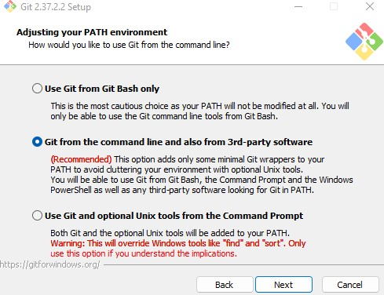

<h2>🛠️ Getting Started with R and Git / Installation Guide</h2>

In order to "clone" (copy) this repository to your machine and follow along with the R workshop, you will need to install Git, R, RStudio, and several R packages to your machine.
I will provide the installation steps for a Windows machine, but the steps are very similar for MacOS or Linux.

<p><b>1.
Install Git </b></p>

-   Follow the steps at this link: <https://git-scm.com/book/en/v2/Getting-Started-Installing-Git>

I think it is a good idea to allow this option to install git into your PATH so that RStudio can find it.



It is also helpful to allow git to install the credential manager to help with storing your github credentials.


-   Finally, I also recommend to install / allow Git bash during the installation.

<p><b> 2.
Install R </b></p>

-   Before you install RStudio, you should first install R from the following link: <https://cran.rstudio.com/>

If you already have R on your machine, I recommend at least R version 4.0 or better to follow along with the code in this repo.
If you use an older version of R, you may see some warnings about R packages being built with a different version, but usually everything will still work.

<p><b> 3.
Install RStudio </b></p>

-   Install RStudio Desktop from the following link: <https://www.rstudio.com/products/rstudio/download/#download>


As shown in the screenshot, R should be installed first, as we did in the previous step.

<p><b> 4.
Sign up for a Github account </b></p>

-   If you have not done so already, register for an account at <https://github.com/>

-   There are some benefits to linking your Github account to your school email (<https://education.github.com/benefits>).

-   Below, I recommend that you use the same primary email address that you use for github when you set your user.email in git.
    You can use a personal email as your primary email on Github and also link your Github account to your (secondary) school email as well, if desired.

<p><b> 5.
Open RStudio and set your Git credentials </b></p>

-   To work with Git, you need to set your user name and email.
-   There are many ways to do this, but an easy way is using RStudio's built-in terminal.


-   Click on the "terminal" tab that should be next to console.
-   Type the following commands

```         
git config --global user.email "your@email.com"
```

```         
git config --global user.name "Your Name"
```

-   NOTE: If this step doesn't work, don't worry. Just keep going. This might not work if you did not install Git bash, but you should still be able to keep going.

<p><b> 6.
Clone this repo as a project in RStudio </b></p>

-   <b><ins> IMPORTANT: You need to create a local directory to hold the local copy of this repository on your computer.
    DO NOT put this directory inside Dropbox.
    Dropbox and Git do not play well together unless you are an advanced user.
    I recommend to use a simple directory on your main drive that is easy to find.
    </b></ins>

-   At the top of this page, click the green code button and copy the https link to this repo.


-   In RStudio, click File -\> New Project.
    On the next menu, click "Version Control" and choose Git.

-   Paste the URL into the box, as follows:


-   Click "Create Project"

<p><b> 7.
Open the "--Install-Packages.R" script in the "src" folder in RStudio </b></p>

-   Run the commands in this file by highlighting them and pushing "ctrl+Enter" or by highlighting them and clicking "run."

-   If you are able to successfully connect to WRDS you should see a line like this output in your console:


-   If you were able to successfully install the packages and connect to WRDS, you should now be ready to follow along for the coding workshop.
